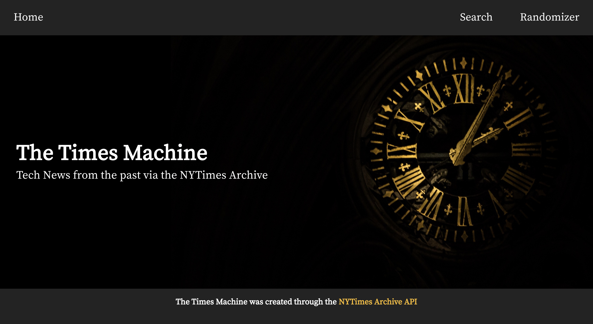
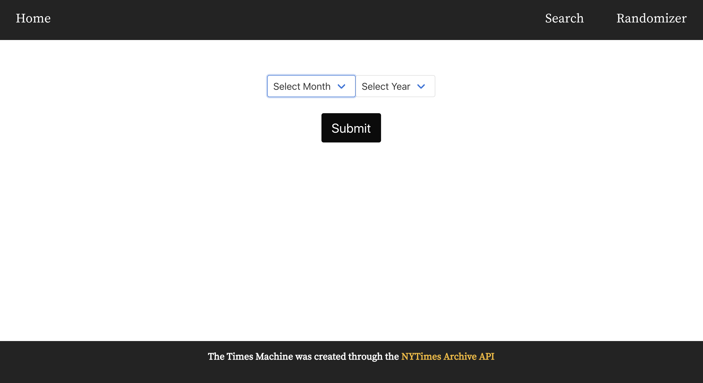
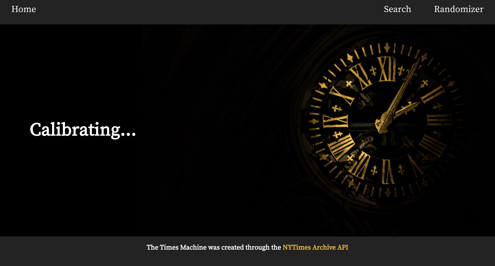
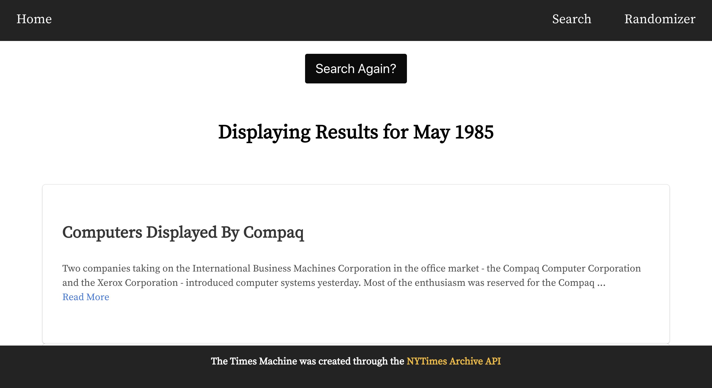
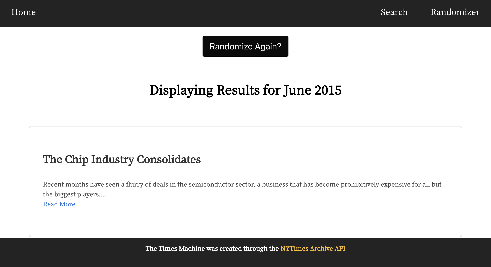

# General Assembly SEI Project 2: Reactathon App

[Portfolio Link](https://wdi-times-machine.herokuapp.com/)

<!-- [GitHub Repo](https://github.com/sohaveaniceday/wdi-project-2) -->

## Brief

In teams of 3 we had to render an app that retrieves data from a public API in an interesting and engaging manner. We had just under 48 hours to achieve this goal, making it extremely time sensitive.

## Technologies Used:

* JavaScript
* React
* Axios
* Insomnia
* Webpack
* NPM
* HTML5
* Bulma + CSS + Sass
* Git
* GitHub

## Approach Taken

The Times Machine is a tech news app which leverages the vast New York Times Archive API. Our app allows readers to step back in time and find tech stories from the past. Users can search for technology and science stories dating back to the 1920s.

---

## Screenshot Walk-through

### Home page with app title and short description.



### The search page that allows the user to select their desired month and year.



### The loading page displays while the app searches the API.



### Results page displays results (limited to 20) with headline and short article snippet. Users can choose to read more via the 'Read More' link, which takes users to the full article on the NYT website.



### The Randomizer page returns results for a random month and year.



___

### Functionality

To access stories, the user simply selects a month and year on the search page for results to appear. Our app also features a randomizer, which returns results from a random year and month.

### Process
The creation of our app began with testing out the NYT Archive API. After experimenting with results through Insomnia, our team took the following steps:
1. Creating a webpack from scratch.
2. Creating the app’s wireframes.
3. Writing out and planning the pseudo code.
4. Creating the main pages and necessary components in React: home, searchesNew, searchesForm, randomizer, nav, footer etc.
5. Creating a search function that successfully navigates the NYT Archive's eclectic metadata. Due to the sheer amount of data, our main goal was to successfully filter for tech and science-related articles.
6. To style our page, we used a combination of Bulma, Sass and an Animations NPM package.


#### Featured piece of code 1

The below code demonstrates the lengths we had to navigate NYT Archive API's metadata. Depending on the year the user had selected there would be a different way to filter for tech article due to the nature of the inconsistent metadata. To allow for this we had to allow for every eventuality in successfully retrieving the right results.

``` JavaScript
handleSubmit(e) {
  {this.state.data.year && this.state.data.month &&
  this.setState({ loading: 'true' })
  e.preventDefault()
  console.log(this.state.data.year, this.state.data.month, key)
  axios.get(`https://api.nytimes.com/svc/archive/v1/${this.state.data.year}/${this.state.data.month}.json?api-key=${key}`)
    .then(res => {
      const stories = res.data.response.docs.filter(story => story.keywords.find(item => {
        return (item.value.includes('Technology') || item.value.includes('TECHNOLOGY'))
      }) || (story.section_name !== null && story.section_name.includes('Technology')))
      this.setState({ stories, loading: 'false' })
    })
    .catch(err => console.log(err))
    .catch(err => this.setState({ errors: err.response.data.errors }))
  console.log(this.state)
  }
}
```

### Styling

We decided to keep the styling quite minimal to allow the user interface to be as clear and intuitive as possible. By using some classical imagery and colour schemes it has a very timeless look. Adding the background imagery of the clock lends itself the idea or time travel, but also the invent of technology.

#### Featured piece of code 2

The below demonstrates the use of ES6's spreading function to change state without mutating it when the user chooses a month and year. It also allows for any errors to be added to state.

``` JavaScript
  handleChange(e) {
    const name = e.target.name
    const value = e.target.value
    const data = {...this.state.data, [name]: value}
    const errors = {...this.state.errors, [name]: ''}
    this.setState({ data, errors })
  }

```
___

### Challenges

Whilst the NYT Archive has a very impressive volume of articles within its API, it also has very little documentation. This limitation meant we had to become more creative with our problem solving ability to handle it's enormous metadata (with some glaring inconsistencies).

With the time constraint, we also had to streamline our way of working to allow for the best possible output in the time given. This meant focusing on the key MVP elements of the app, rather than focusing on superfluous features.

### Wins

Creating our app strengthened our knowledge of React and also gave us an opportunity to experiment and play around with ideas. Our top wins include:

* The fluid style of our site/app being highly customized through the use of common tools like Bulma.
* Displaying results in a easily digestible manner.
* Generating a loading page whilst the API retrieves the story data
* Creating a “Randomizer” function
___

## Future Features

If we had more time during Reactathon, essential future features we would like to add include:

* A 'No Results' message when the search doesn't return anything.
* Creating social sharing buttons to give users an opportunity to interact better with the site. Also, adding images to results for both older and more recent stories (instead of just headlines).
* Establishing more CSS animation and functionality on all pages.
* Adding more information and instructions (either on pages or through a pop-up window) about the app and our intent.
